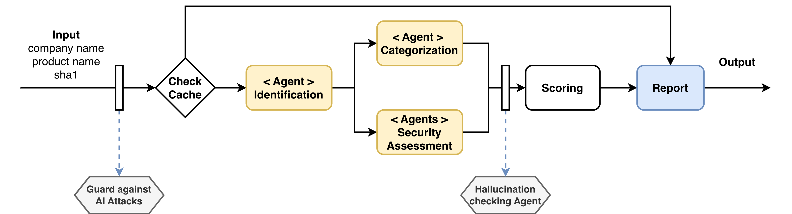
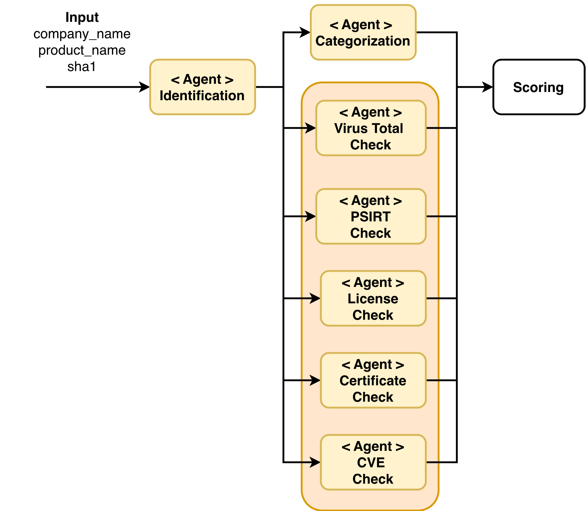
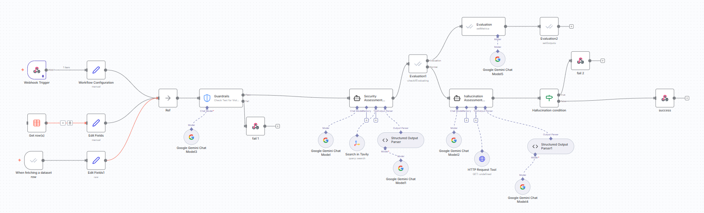

# PlantBase – SISU (Security Intel Summary)

> Building SISU for CISOs – trusted summaries in minutes.

PlantBase is an AI-assisted security assessor that turns a product name, URL, vendor, or binary hash into a CISO-ready, decision-ready brief.  
It fetches public security signals from the web, normalizes and scores them along four major axes, and produces both human-readable and machine-readable outcomes:

- A concise decision sentence for the CISO (approve / cautious approve / do not approve / insufficient evidence)
- A normalized safety score in the range `[0.0, 1.0]`
- A confidence level in `{low, medium, high}`
- A graph of safety in different scopes
- A curated set of verifiable sources and evidence

The goal is to move security teams from reactive firefighting to proactive enablement, by making vendor/tool assessments cheap, fast, and repeatable.


---


## Architecture

At a high level, the pipeline looks like this:



You can also see more details about the Security Assesment in the following picture:



1. **Check Cache**

   * Given the input (sha1/url/vendor/product), check whether a recent assessment exists.
   * If found and not expired, return the cached result.

2. **Sanitize input and check input for violation**

   * Check the inputs for any sign of LLM prompt poisoning and jailbreak attempts.

3. **Identification Agent**

   * Resolve which entity we are assessing (binary, SaaS, on-prem, library, etc.).
   * Normalize the entity metadata: canonical product name, vendor, URLs, repository links.

4. **Categorization Agent**

   * Classify the product into one of 10 allowed categories.
   * Generate three descriptive keywords for future retrieval and similarity search.

5. **Security Assessment Agents (parallel fan-out)**

   * VirusTotal Check Agent
   * PSIRT Check Agent
   * License Check Agent
   * Certificate / Compliance Check Agent
   * CVE Check Agent
   * (Optionally more: privacy policy, DPIA hints, breach history, etc.)

6. **Hallucination-Checking Agent**

   * Validate that all claims in the generated summary are grounded in retrieved sources.
   * Remove unsupported claims and downgrade confidence if needed.

7. **Scoring Engine**

   * Aggregate agent signals into five axis scores and a global `safe_score` and `confidence`.

8. **Decision Engine**

   * Apply deterministic rules to get the final decision sentence.

9. **Report Generator**

   * Produce a structured HTML report for the web UI.

10. **Persistence / Cache**

   * Store the full assessment in a database (including sources and input parameters).

The logical architecture corresponds to:

* `plantbase-arch.png` – high-level pipeline from input to report.
* `plantbase-agents.png` – detail of the security assessment agent cluster.


### Cache-Aware Classification Alternative

To optimize for repeated or similar products:

1. **Check cache for already identified products** with the same category and shared keywords similarity.
2. If a close match with **high confidence** exists:

   * Introduce that product as an appropriate alternative.
3. If no adequate match exists:

   * Perform a fresh search + one pass of our tool on the new alternative.
   * Store the result back into the cache for future reuse.

---


## Algorithms

### Safety scoring system

#### How `final_trust_score` is calculated

The system runs several independent checks on a product:

- **Product assessment** (general info, vendor, website, etc.)
- **License scan** (e.g., GitHub repo licensing)
- **VirusTotal check** 
- **Security certifications scan**
- **CVE-based risk score** 
- **Product Security Incident Response Team assessment**

Each of these checks produces its own **trust score** (typically between 0 and 1, where higher means “more trustworthy”).

To compute the **final_trust_score**:

1. Collect all individual trust scores that are available and valid.
2. Take the **simple average** (arithmetic mean) of all these trust scores.

This average is the **final_trust_score**.  


#### How `confidence` is calculated

Each check also produces a **confidence score** (again between 0 and 1, where higher means “we are more sure about this signal”).

To compute the **final confidence**:

1. Take the confidence scores from:
   - Product assessment  
   - License scan  
   - VirusTotal  
   - Certificates scan  
   - CVE scan  
   - Product Security Incident Response Team assessment  

2. Compute their **average** → this gives a single numeric **final_confidence_score**.

3. That numeric score is then mapped to a label:
   - **LOW**
   - **MEDIUM**
   - **HIGH**

Conceptually:

- **final_trust_score** = *How good / safe does the product look across all evidence?*  
- **confidence** = *How sure are we about that judgment, given the quality and agreement of the signals?*


### Final desicion algorithm

Based on `safe_score ∈ [0, 1]` and `confidence ∈ {"low", "medium", "high"}`, PlantBase produces one of a small set of **deterministic decision sentences**.

#### 1. Low confidence (any score) → Insufficient public evidence

**Rule**

* `confidence == "low"`
* (Ignore score)

**Sentence**

> Decision: No decision – insufficient public evidence.
> The available public information is not sufficient to make a reliable security assessment of this tool (current safety score: {safe_score}, confidence: low). Please obtain more vendor or third-party security documentation before approving use.

---

#### 2. Medium confidence

##### 2.1 Medium confidence + low score → Cannot be trusted

**Rule**

* `confidence == "medium"`
* `safe_score < 0.35`

**Sentence**

> Decision: Do not approve – tool cannot be trusted (medium confidence).
> Current public evidence indicates notable security or trust concerns (safety score: {safe_score}, confidence: medium). The tool should not be deployed unless additional, strong evidence can address these risks.

##### 2.2 Medium confidence + mid score → Probably safe, alternatives suggested

**Rule**

* `confidence == "medium"`
* `0.35 ≤ safe_score ≤ 0.75`

**Sentence**

> Decision: Cautious approval – probably safe, but alternatives are recommended where feasible.
> The tool appears reasonably safe based on current public evidence (safety score: {safe_score}, confidence: medium), but where possible we recommend preferring alternative products with stronger or better-documented security assurance.

##### 2.3 Medium confidence + high score → Tool can be trusted (check sources)

**Rule**

* `confidence == "medium"`
* `safe_score > 0.75`

**Sentence**

> Decision: Approve – tool can be trusted, please review sources.
> The assessment suggests that this tool is safe to use (safety score: {safe_score}, confidence: medium). The tool can be approved, but the CISO or security team should review the attached sources for more detailed assurance.

---

#### 3. High confidence

##### 3.1 High confidence + low score → Cannot be trusted with high confidence

**Rule**

* `confidence == "high"`
* `safe_score < 0.35`

**Sentence**

> Decision: Do not approve – tool cannot be trusted with high confidence.
> Available public evidence indicates significant security or trust issues (safety score: {safe_score}, confidence: high); the tool should not be deployed in our environment.

##### 3.2 High confidence + mid score → Probably safe, alternatives suggested

**Rule**

* `confidence == "high"`
* `0.35 ≤ safe_score ≤ 0.75`

**Sentence**

> Decision: Cautious approval – probably safe, but prefer stronger alternatives.
> The tool appears generally safe based on current public evidence (safety score: {safe_score}, confidence: high). It can be used, but where possible we recommend alternatives with higher safety scores or more robust security assurances.

##### 3.3 High confidence + high score → Tool can be trusted with high confidence

**Rule**

* `confidence == "high"`
* `safe_score > 0.75`

**Sentence**

> Decision: Approve – tool can be trusted with high confidence.
> The public evidence supports using this tool in our environment (safety score: {safe_score}, confidence: high). No additional security-driven restrictions are required beyond standard controls.


---

## Setup Instructions

### 1. Configure n8n Workflows

1. Upload the provided **n8n JSON documents** into the appropriate workflows in your n8n instance.
2. Configure each workflow with the required **API keys** and secrets.
3. Set the n8n environment to **production**.
4. Ensure the workflows are **enabled** and running.


You can see an example of one of the n8n workflows in the following:




---

### 2. Install Python Dependencies

Use the provided `requirements.txt` file to install all necessary Python packages:

```bash
pip install -r requirements.txt
```

---

### 3. Run the Tool via CLI

You can interact with the tool using the Python CLI interface.

Example command:

```bash
python app.py --product="Zoom" --vendor="Zoom Video Communications, Inc." --sha1="fd797e4071afe131104c1d29cd0cb606da62f3d5"
```

Replace the values of `--product`, `--vendor`, and `--sha1` as needed for other tools you want to assess.

---


